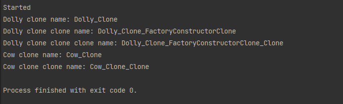

## Порождающие шаблоны проектирования
###### Вебинар от 16.11.23

### Домашнее задание
Реализуем паттерн "Прототип"

**Цель**:  
Создать иерархию из нескольких классов, в которых реализованы методы клонирования объектов по шаблону проектирования "Прототип".

**Описание/Пошаговая инструкция выполнения домашнего задания**:
0. Придумать и создать 3-4 класса, которые как минимум дважды наследуются и написать краткое описание текстом.
1. Создать свой дженерик интерфейс IMyCloneable для реализации шаблона "Прототип".
2. Сделать возможность клонирования объекта для каждого из этих классов, используя вызовы родительских конструкторов.
3. Составить тесты или написать программу для демонстрации функции клонирования.
4. Добавить к каждому классу реализацию стандартного интерфейса ICloneable и реализовать его функционал через уже созданные методы.
5. Написать вывод: какие преимущества и недостатки у каждого из интерфейсов: IMyCloneable и ICloneable.

### Инструкция запуска

1. Склонируйте приложение и зайдите в проект:  
   `git clone https://github.com/antoha-p/otus-hw9-16.11.23.git && cd otus-hw9-16.11.23`
2. Откройте решение и запустите проект:

